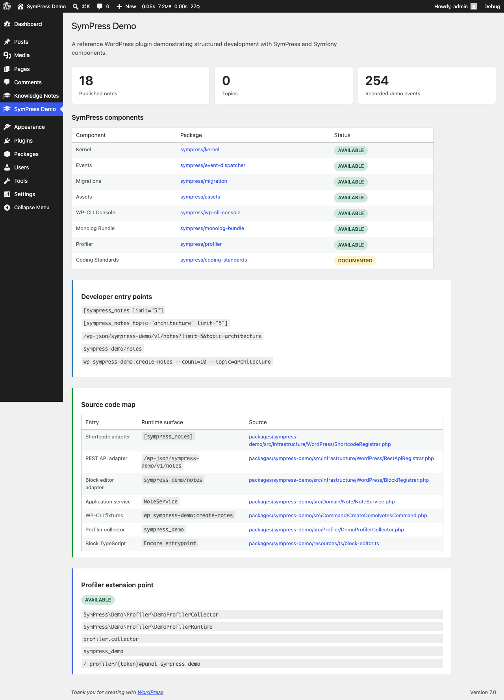

# SymPress Demo

**A reference WordPress website for learning structured development with SymPress and Symfony components.**

SymPress Demo is the central demo project for the public SymPress repositories. It is a complete Composer-based WordPress website with a real demo plugin, DDEV setup, WP-CLI seed workflow, admin UI, frontend output, migrations, optional event telemetry, ORM-mapped demo event records, logging, Composer-driven Encore/TypeScript assets and development profiler integration.

The goal is the same kind of learning value as the Symfony Demo application: a small realistic application that shows best practices in context. Here the runtime is WordPress, and SymPress brings Symfony-style architecture where it helps.

## Core Idea

WordPress remains the runtime. SymPress adds application structure around the places where larger WordPress projects usually become hard to reason about.

That means:

- WordPress still handles requests, admin screens, content editing, themes, plugins, hooks and blocks.
- SymPress provides a kernel, service container, hook registration, package discovery and runtime tooling.
- The demo plugin keeps WordPress API calls at the boundary and puts application behavior into services.
- Build assets, CLI commands, migrations, logs and profiler panels are treated as part of the application, not as afterthoughts.

This project is not trying to replace WordPress. It shows how to keep WordPress as the platform while giving developers a more explicit architecture for complex plugin and website work.

## How To Read This Demo

Use the project as a guided learning path:

1. Run the website and look at the homepage.
2. Open `WP Admin -> SymPress Demo` to see the component dashboard.
3. Follow the block flow from `BlockRegistrar` to `Service\NoteService` to `Repository\WordPressNoteRepository`.
4. Inspect `NoteRenderTelemetry`, `NoteRenderedEvent` and `LogRenderedNoteSubscriber` to see how optional side effects are separated from read queries.
5. Open the development profiler toolbar and select the `SymPress Demo` panel.
6. Read the deeper documentation in [`docs/`](docs/README.md).

Recommended deep dives:

- [Architecture](docs/architecture.md)
- [SymPress Components](docs/sympress-components.md)
- [Developer Walkthrough](docs/developer-walkthrough.md)

## What It Demonstrates

The website contains a "Knowledge Notes" application:

- Public note listing on the website.
- WordPress admin CRUD through a custom post type.
- Topic filtering through a taxonomy.
- REST API endpoint: `/wp-json/sympress-demo/v1/notes`.
- Dynamic block editor block: `sympress-demo/notes`.
- WP-CLI seed command: `wp sympress-demo:create-notes`, with real quote notes from the ZenQuotes API and a local fallback.
- Optional event dispatching when rendered notes are explicitly tracked.
- Logging of tracked rendered notes.
- Versioned SymPress migration for the demo event table.
- ORM entity and repository access for the demo event table.
- Admin dashboard showing component status.
- Service container map showing aliases, adapters and parameterized services.
- Composer asset compilation through `sympress/asset-compiler`.
- Starter-compatible project conventions such as `bin/console`, WPStarter orchestration and a base MU package.
- Source-code links in the admin dashboard.
- Encore-built admin, frontend and block editor assets.
- Multilingual plugin textdomain with POT and German PO example.
- SymPress Profiler default collectors plus a demo-specific collector example.
- DDEV local development environment and runtime smoke testing.

## Symfony Demo Parallels

| Symfony Demo idea | SymPress Demo implementation |
|---|---|
| Reference application | Composer-based WordPress website |
| Blog posts | `sympress_note` custom post type |
| Tags/categories | `sympress_topic` taxonomy |
| Public pages | WordPress frontend with dynamic block output |
| Backend/admin | WordPress admin CPT screens plus SymPress dashboard |
| Fixtures | WP-CLI adapter with `DemoNoteSeeder` and named fixture sets |
| Services | Query and seed use cases with repository/writer contracts |
| Events | Opt-in `NoteRenderTelemetry`, `NoteRenderedEvent` and subscriber |
| Database changes | Versioned `sympress_demo_events` migration |
| ORM | `DemoEventRecord` entity and `DemoEventRecordRepository` |
| API | WordPress REST route backed by the service layer |
| Editor integration | Dynamic block rendered by the same PHP callback |
| Debug tooling | SymPress Profiler config and custom demo collector |
| Best-practice structure | Packages, services, thin hooks and explicit config |

The parallel is conceptual, not cosmetic. Symfony Demo teaches framework conventions by showing a complete application. SymPress Demo teaches WordPress application structure by showing the same kinds of concerns inside a WordPress runtime.

## Public SymPress Components

| Repository | How this demo uses it |
|---|---|
| [`SymPress/kernel`](https://github.com/SymPress/kernel) | The `base-mu-plugins` app starter boots the site `SiteKernel`; the demo plugin contributes bundle metadata and services. |
| [`SymPress/event-dispatcher`](https://github.com/SymPress/event-dispatcher) | The note workflow keeps queries read-only and exposes optional telemetry through the SymPress event system. |
| [`SymPress/migration`](https://github.com/SymPress/migration) | The demo event table is modeled as a versioned migration. |
| [`SymPress/assets`](https://github.com/SymPress/assets) | Encore-built admin and frontend assets are registered through `EncoreEntrypointsLoader`. |
| [`SymPress/asset-compiler`](https://github.com/SymPress/asset-compiler) | Composer discovers the demo package asset contract and runs its production build through `composer compile-assets`. |
| [`SymPress/wp-cli-console`](https://github.com/SymPress/wp-cli-console) | The demo ships a WP-CLI command and can expose console workflows through the kernel. |
| [`SymPress/monolog-bundle`](https://github.com/SymPress/monolog-bundle) | Root config defines Monolog handlers and the subscriber writes PSR-3 logs. |
| [`SymPress/orm`](https://github.com/SymPress/orm) | The demo event table is mapped as an ORM entity and read/written through a repository. |
| [`SymPress/profiler`](https://github.com/SymPress/profiler) | The development install can contribute the toolbar, profile pages and default collectors; the demo plugin adds one package-specific collector as an extension example. |
| [`SymPress/coding-standards`](https://github.com/SymPress/coding-standards) | The package follows the same QA shape and can run the shared coding standard. |

For a deeper package-by-package explanation, read [SymPress Components](docs/sympress-components.md).

## Requirements

- DDEV
- Docker
- Composer 2
- PHP 8.5 in the project runtime

## Installation

```bash
git clone https://github.com/SymPress/demo.git sympress-demo
cd sympress-demo
cp .env.example .env
ddev start
ddev composer install
```

WP Starter installs WordPress into `public/wp`, uses `public/wp-content` as the content directory and runs the orchestration script from `dev-ops/orchestrate.php`.

The runtime bootstrap is deliberately explicit:

1. Composer installs WordPress, themes, plugins and MU plugins into `public/`.
2. WP Starter generates the MU loader and runs `dev-ops/orchestrate.php`.
3. WordPress loads `packages/base-mu-plugins/app-starter.php`.
4. The app starter boots the shared SymPress `SiteKernel`.
5. The kernel discovers active SymPress bundles through Composer metadata and WordPress plugin state.
6. Bundle and site configuration register hooks, routes, commands, collectors and services.

Public SymPress packages are resolved from Packagist. The path repository points only at local demo packages under `packages/*`, so the website can install the demo feature plugin and base MU package while they are developed in the same repository.

Open the site:

```text
https://sympress-demo.dev
```

Default local admin credentials from `.env.example`:

```text
admin / admin
```

## Screenshots

The repository includes fresh screenshots from the DDEV site:

- [Frontend desktop](docs/images/frontend-desktop.png)
- [Frontend mobile](docs/images/frontend-mobile.png)
- [Admin dashboard with source-code links](docs/images/admin-dashboard.png)
- [SymPress Demo profiler panel](docs/images/profiler-sympress-demo.png)




## Local Development

```bash
ddev start
ddev composer install
ddev composer compile-assets
ddev composer build:production
ddev exec 'vendor/bin/wp plugin activate sympress-demo'
ddev exec 'vendor/bin/wp sympress-demo:create-notes --set=quotes --count=18 --reset'
ddev exec ./bin/console wp:plugin:list
```

Useful paths:

```text
public/                         WordPress docroot
public/wp/                      WordPress core installed by Composer
public/wp-content/              WordPress content directory
packages/base-mu-plugins/       Must-use bootstrap and WordPress runtime package
packages/sympress-demo/         Demo plugin package
config/                         Site-level SymPress kernel config
dev-ops/                        WP Starter orchestration
.ddev/                          Local DDEV runtime
```

## Project Shape

The repository is a website project, not a single plugin folder. The important split is:

- `packages/base-mu-plugins/` boots the shared SymPress kernel and applies generic WordPress runtime setup.
- `packages/sympress-demo/` contains the demo feature package, its bundle metadata, service configuration, WordPress adapters, services, assets, tests and development-only profiler collector.
- `config/` contains site-level SymPress configuration that can override package defaults.
- `public/` is the WordPress docroot generated by Composer and WP Starter.

The architectural rule is: let WordPress integration code talk to WordPress, but keep application decisions in services that can be understood and tested without a full browser request.

For the full mental model, directory tree and request lifecycle, read [Architecture](docs/architecture.md).

## WordPress Admin

After installation, visit:

```text
WP Admin -> SymPress Demo
```

The dashboard shows:

- Published notes
- Topics
- Recorded demo events
- Latest ORM event records
- SymPress component status
- Service container aliases and adapters
- Starter project conventions
- Developer entry points
- Source code map linking UI concepts to repository files
- Profiler package status and the demo-specific collector extension point

Notes are managed through the `Knowledge Notes` custom post type.

## Frontend Usage

Add the dynamic block in the Site Editor or block editor:

```text
sympress-demo/notes
```

The DDEV orchestration creates a homepage containing the block:

```text
<!-- wp:sympress-demo/notes {"limit":6} /-->
```

The block supports `limit` and `topic` attributes. For example:

```text
<!-- wp:sympress-demo/notes {"limit":5,"topic":"quotes"} /-->
```

The same note query is available through the REST API:

```text
/wp-json/sympress-demo/v1/notes?limit=5
/wp-json/sympress-demo/v1/notes?topic=architecture&limit=5
```

Its editor script lives in `resources/ts/block-editor.ts`, while the PHP render callback lives in `BlockRegistrar`.

## Assets

The demo plugin uses Symfony Webpack Encore with TypeScript:

```bash
ddev composer compile-assets
```

The website root owns asset compilation through `sympress/asset-compiler`. `composer compile-assets` discovers the demo plugin package, installs its frontend dependencies when needed and runs the configured build script. `composer build:production` calls the compiler in production mode and then runs the runtime smoke command.

Encore writes `assets/entrypoints.json`, CSS, JS and WordPress dependency extraction metadata. `DemoAssetRegistrar` loads those entrypoints through `sympress/assets`, which keeps asset registration aligned with the real project packages.

The build contains separate entries for admin, frontend and block editor code.

## Profiler

The website installs `sympress/profiler` as a development dependency. When the site runs in a development environment and the kernel discovers the active profiler bundle, the package can register the toolbar, profile pages and its default collectors.

The demo plugin additionally registers one app-specific collector from `packages/sympress-demo/config/services_development.yaml`:

```text
SymPress\Demo\Profiler\DemoProfilerCollector
profiler.collector
sympress_demo
```

Open a collected profile to inspect the built-in request, performance, database, hook, asset, template, block, option and kernel panels. Then select the `SymPress Demo` panel to see how a package can add its own runtime metrics.

Profiler collection is enabled in `config/packages/development/profiler.yaml`, which is loaded only for the development environment. This keeps profiling out of production while making the demo immediately inspectable after local setup.

## WP-CLI Examples

```bash
ddev exec 'vendor/bin/wp sympress-demo:create-notes'
ddev exec 'vendor/bin/wp sympress-demo:create-notes --set=quotes --count=10'
ddev exec 'vendor/bin/wp sympress-demo:create-notes --set=quotes --source=local --count=10'
ddev exec 'vendor/bin/wp sympress-demo:create-notes --set=architecture --count=10'
ddev exec 'vendor/bin/wp sympress-demo:create-notes --set=frontend --count=6'
ddev exec 'vendor/bin/wp sympress-demo:create-notes --set=quotes --count=18 --reset'
```

The command creates demo content without embedding fixture logic in the plugin bootstrap or the CLI adapter itself. The default `quotes` set fetches real quote data from the free ZenQuotes endpoint during seeding and stores the result as WordPress notes through a writer port. Free ZenQuotes usage requires attribution and is rate-limited, so the command also supports `--source=local` and falls back to bundled quote examples if the API cannot be reached. The architecture-oriented fixture sets are still available as `architecture`, `frontend`, `operations` or `all`.

## Testing And Quality

Before running QA, install the site through DDEV and make sure the database is available. The runtime smoke check uses the demo plugin's WP-CLI command against the generated WordPress installation, so it expects the demo plugin, REST route and dynamic block to be registered.

```bash
ddev composer qa
ddev npm --prefix packages/sympress-demo run typecheck
ddev npm --prefix packages/sympress-demo run audit
ddev playwright
```

The QA command runs repository and package checks:

- Composer validate
- Composer audit
- PHPCS
- PHPStan
- PHPUnit
- Runtime smoke command through WP-CLI
- Browser smoke test through Playwright in DDEV

The base MU package and feature plugin both run through the root QA command. JavaScript type checking and npm audit are exposed as separate npm scripts and GitHub workflow jobs. The DDEV Playwright smoke test opens the demo homepage and fails when the rendered response contains PHP or WordPress fatal errors.

The tests focus on read-only service behavior, opt-in telemetry dispatching, bootstrap shape and live WordPress registration. The runtime smoke command verifies REST route registration, block registration and block rendering against the DDEV WordPress runtime.

## Troubleshooting

If `ddev composer qa` fails before the runtime smoke command, run `ddev composer install` so Composer can install WordPress, generate the MU loader and build assets.

If the homepage has no notes, run:

```bash
ddev exec 'vendor/bin/wp sympress-demo:create-notes --set=quotes --count=18 --reset'
```

If the `SymPress Demo` admin page is missing, activate the plugin:

```bash
ddev exec 'vendor/bin/wp plugin activate sympress-demo'
```

If the profiler toolbar is missing, check that the site runs in a local/development environment, `sympress/profiler` is installed through development dependencies, profiler collection is enabled locally and the SymPress kernel cache has been rebuilt after dependency changes.

If generated CSS or JavaScript is stale, run the SymPress Asset Compiler:

```bash
ddev composer compile-assets
```

## Repository Topics

Suggested GitHub topics:

```text
wordpress
wordpress-plugin
php
symfony
dependency-injection
composer-package
composer-plugin
wordpress-development
wp-cli
event-dispatcher
php-library
database-migrations
developer-tools
```

## License

This project is licensed under the MIT License.
