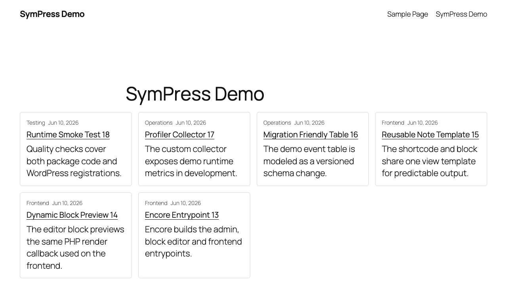
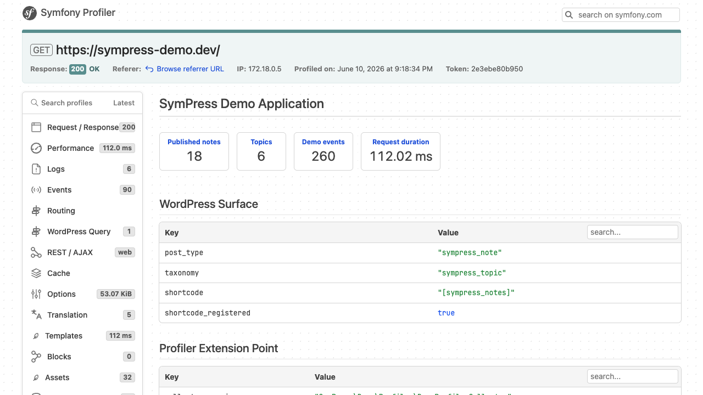

# SymPress Demo Documentation

This documentation explains the idea behind the SymPress Demo project and how to read the code as a developer.

Start here:

- [Architecture](architecture.md): the mental model, runtime flow and package boundaries.
- [SymPress Components](sympress-components.md): where each public SymPress package is used and why.
- [Developer Walkthrough](developer-walkthrough.md): follow one feature through the dynamic block, service, events, persistence, assets and profiler.

The short version: WordPress remains the runtime, editor, admin and content platform. SymPress adds Symfony-style structure at the points where larger WordPress projects usually become hard to reason about: bootstrapping, dependency injection, hooks, events, assets, migrations, CLI, logging and profiling.

## Screenshots

- [Frontend desktop](images/frontend-desktop.png)
- [Frontend mobile](images/frontend-mobile.png)
- [Admin dashboard with source-code links](images/admin-dashboard.png)
- [SymPress Demo profiler panel](images/profiler-sympress-demo.png)

## Runtime Examples

- Block: `sympress-demo/notes`
- REST API: `/wp-json/sympress-demo/v1/notes?topic=architecture&limit=5`
- Quote seed: `wp sympress-demo:create-notes --set=quotes --count=18 --reset`
- Runtime smoke test: `ddev composer qa`
