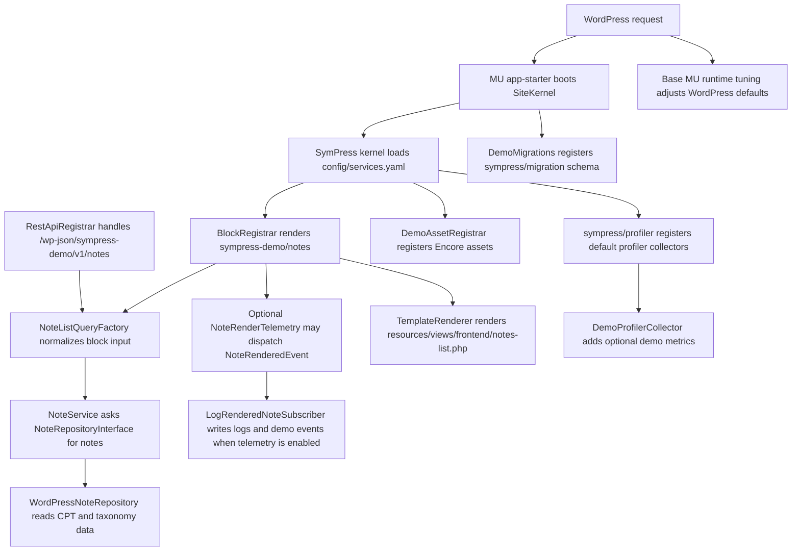

# Architecture

## Core Idea

SymPress Demo is a WordPress website that is intentionally structured like a modern PHP application.

The goal is not to hide WordPress behind a framework. WordPress still owns the request lifecycle, the admin UI, content editing, rewrite rules, hooks, taxonomies, blocks and themes. SymPress is used where structure improves maintainability:

- a kernel builds and caches a service container;
- services express application behavior without reaching into globals everywhere;
- WordPress hooks become thin adapters;
- domain code is separated from WordPress integration code;
- events make side effects explicit;
- migrations, ORM records, CLI commands, compiled assets, logs and profiler panels are first-class project concerns.

This is the guiding sentence:

> WordPress is the runtime. SymPress is the application structure around the parts that need to scale.

## Project Shape

This repository is a website project, not only a plugin package.

```text
demo/
|-- .ddev/                       Local WordPress runtime
|-- bin/                         Developer commands
|-- config/                      Site-level SymPress configuration
|-- dev-ops/                     WP Starter orchestration
|-- packages/
|   |-- base-mu-plugins/         Must-use bootstrap and runtime package
|   `-- sympress-demo/           The reference plugin package
|-- public/                      Web root
|-- composer.json                Website dependencies
`-- composer.lock                Reproducible Composer resolution
```

The plugin package is the application package inside the website:

```text
packages/sympress-demo/
|-- assets/                      Built Encore output consumed by WordPress
|-- config/services.yaml         Package-level services, aliases and parameters
|-- languages/                   POT and German PO example
|-- resources/
|   |-- blocks/                  Dynamic block metadata
|   |-- scss/                    Asset source styles
|   |-- ts/                      TypeScript entrypoints
|   `-- views/                   PHP templates at the boundary
|-- src/
|   |-- Admin/                   WordPress admin page
|   |-- Application/             Query and seed use cases
|   |-- Asset/                   Asset registration adapter
|   |-- Command/                 WP-CLI command
|   |-- Entity/                  Plain PHP note/topic entities and ORM records
|   |-- Event/                   Application events
|   |-- EventSubscriber/         Explicit side effects
|   |-- Hook/                    Package hooks for migrations and integrations
|   |-- Infrastructure/          WordPress and persistence adapters
|   |-- Migration/               Versioned schema changes
|   |-- Presentation/            Resource shaping for outward-facing adapters
|   |-- Profiler/                Development-only profiler collector example
|   |-- Repository/              Repository contracts and WordPress implementation
|   |-- Service/                 Application services
|   `-- Support/                 Small framework-neutral helpers
`-- tests/                       Unit and integration tests
```

The website boots the SymPress site kernel from `packages/base-mu-plugins/app-starter.php`. This mirrors the real reference project: the application runtime starts in a must-use package, while feature plugins stay focused on their own bundle metadata, autoloading and service configuration.

The same base MU package also contains production-shaped WordPress runtime concerns:

- `000-error-reporting.php` keeps debug output useful without leaking notices into REST or JSON responses.
- `allowed-html-tags.php` extends the WordPress sanitizer for media markup used by richer content.
- `vardumper-integration.php` enables Symfony VarDumper output for frontend development when explicitly enabled.

Project-specific MU plugins from the real website are intentionally not copied. The demo keeps only the generic runtime shape that developers can reuse.

The shape intentionally stays close to `sympress/starter`: `bin/console` is the command surface, WPStarter owns WordPress generation, DDEV provides the local runtime and the base MU package boots the site kernel.

## Bootstrap And Package Discovery

The demo intentionally keeps bootstrapping explicit instead of hiding it in a feature plugin:

```text
composer install
  -> installs WordPress, plugins, themes and MU plugins into public/
  -> WP Starter generates the MU plugin loader
  -> WordPress loads packages/base-mu-plugins/app-starter.php
  -> app-starter boots SymPress\Kernel\Kernel\SiteKernel
  -> the kernel discovers active SymPress packages through Composer metadata
  -> package config files register services, hooks, routes, commands and collectors
```

This is the reason a SymPress package can work out of the box once it is installed, discoverable and active. The package owns its bundle metadata and default service configuration; the website owns the kernel bootstrap.

For `sympress/profiler`, that means the development install can contribute its own toolbar, profile pages and default collectors. The demo package only adds `DemoProfilerCollector` in development config to show how an application can append its own panel.

## Request Lifecycle

The frontend page renders a WordPress page whose content includes the demo dynamic block.



Each step has a purpose:

- WordPress integration classes are close to WordPress APIs.
- Application services are small and testable.
- Read queries do not write data; optional side effects are explicit services and subscribers.
- Built assets are registered by a dedicated asset adapter.
- Frontend builds are discovered and run by the SymPress Asset Compiler.
- Runtime understanding is exposed through the profiler.

## Boundaries

The demo uses boundaries that are useful in production WordPress projects:

| Boundary | Why it exists | Example |
|---|---|---|
| Entity | Business data without WordPress API coupling | `Note`, `Topic` |
| Query object | Shared block/REST input normalization | `NoteListQuery`, `NoteListQueryFactory` |
| Repository | Query contract plus WordPress implementation | `NoteRepositoryInterface`, `WordPressNoteRepository` |
| Service | Application behavior | `NoteService` |
| Seed use case | Repeatable content creation without WordPress persistence details | `DemoNoteSeeder`, `CreateDemoNotesRequest` |
| Writer port | Persistence contract for generated notes | `DemoNoteWriterInterface`, `WordPressDemoNoteWriter` |
| WordPress infrastructure | CPT, taxonomy, REST and block adapters | `RestApiRegistrar`, `BlockRegistrar` |
| API infrastructure | REST route that delegates to the same application service | `RestApiRegistrar` |
| Presentation | JSON/resource shaping outside the REST route | `NoteResourceFactory` |
| Editor infrastructure | Dynamic block with a TypeScript editor entry and PHP render callback | `BlockRegistrar` |
| Persistence infrastructure | Database table access | `DemoEventRepository` |
| Migration hook | Register and run package migrations through SymPress Migration | `DemoMigrations`, `CreateDemoEventsTableMigration` |
| Application telemetry | Optional event dispatching outside the query service | `NoteRenderTelemetry`, `NoteRenderedEvent` |
| Subscriber | Logging and event-table writes | `LogRenderedNoteSubscriber` |
| Asset adapter | Runtime registration of compiled frontend/admin assets | `DemoAssetRegistrar` |
| Asset compiler | Composer-level frontend dependency installation and build orchestration | `sympress/asset-compiler` config in `composer.json` |
| Profiler package | Built-in request, performance, WordPress and kernel diagnostics | `sympress/profiler` default collectors |
| Profiler extension | Developer visibility into demo runtime state | `DemoProfilerCollector` |
| Localization | WordPress textdomain loading and translation source files | `LocalizationRegistrar` |

## Why Not Put Everything In The Plugin File?

The must-use app starter answers the runtime question:

- How does the website boot the shared `SiteKernel`?

The demo plugin file should answer only package questions:

- Can WordPress load this package?
- Which Composer autoload file exposes this package?

The demo plugin file therefore contains metadata and autoload discovery only. Runtime hooks, event subscriber registration, migrations, assets, REST routes and blocks are declared in `packages/sympress-demo/config/services.yaml`; the development-only profiler collector is declared in `packages/sympress-demo/config/services_development.yaml`.

## Symfony Style, WordPress Runtime

The demo borrows Symfony ideas where they map well to WordPress:

- Composer packages instead of manually copied plugin folders.
- A kernel and service container instead of global setup scripts.
- Configuration files instead of scattered imperative registration.
- Attributes for hooks and event listeners; tagged services for profiler collectors.
- Console commands for repeatable developer workflows.
- Profiler and logs for runtime feedback.

The demo does not try to turn WordPress into Symfony. The content model, admin screens, theme rendering and plugin lifecycle are still WordPress-native.

## Packagist First

Public SymPress packages are resolved from Packagist. The demo keeps Composer repository configuration narrow: local path packages for the packages developed in this repository, plus WPackagist for WordPress themes and plugins.

The local path repository is:

```json
{
  "type": "path",
  "url": "./packages/*"
}
```

That path repository exists so the website can install the local `sympress/demo-plugin` and `sympress/demo-base-mu-plugins` packages while they are developed in the same repository.
